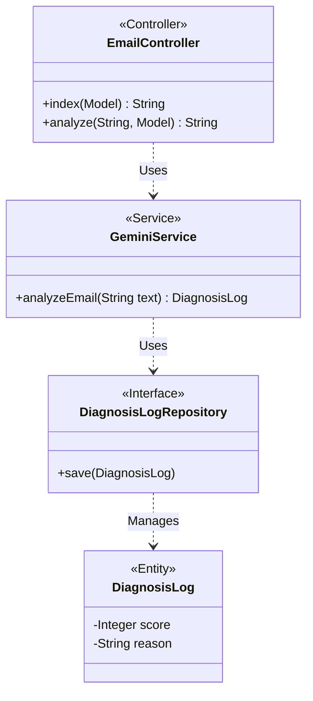
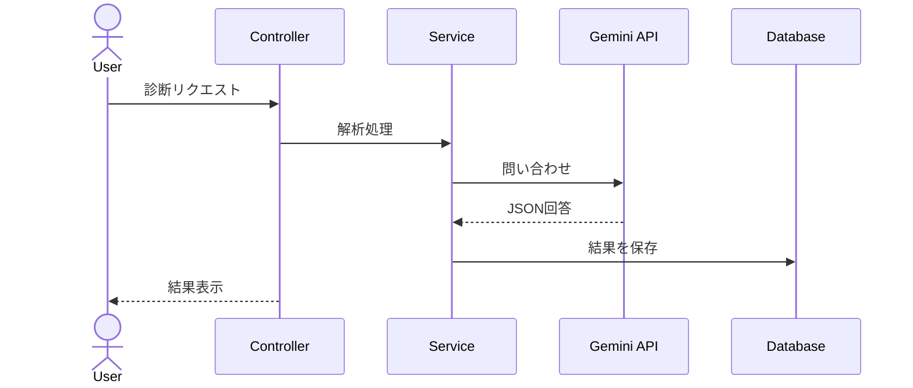

# 🛡️ Email Guardian AI (あやしいメール診断くん)

新入社員やIT初心者をターゲットにした、フィッシング詐欺メールの危険度判定ツールです。
Google Gemini (AI) を活用し、メール本文のリスクスコア判定、危険なキーワードのハイライト、教育的な解説をリアルタイムで提供します。

**Demo URL:** [https://mysterious-jocelyne-xxxx.koyeb.app/](https://mysterious-jocelyne-tototo878742-cf0c598e.koyeb.app/)
(※ここにあなたのKoyebのURLを貼ってください)

## 🚀 開発の背景
「知識がない人でも直感的にメールの危険性を判断できるツールが必要だ」と考え開発しました。
単に「危険」と判定するだけでなく、「なぜ危険なのか」をAIに解説させることで、ユーザーのリテラシー向上も狙っています。

## 🛠️ 技術スタック
### Backend
- **Java 17**
- **Spring Boot 4.0.3 (Web, JPA)
- **Google Gemini API** (Generative AI)

### Frontend
- **Thymeleaf** (Server-side rendering)
- **Bootstrap 5** (Responsive UI)
- **JavaScript** (DOM manipulation for highligting)

### Infrastructure & Database
- **Koyeb** (PaaS for Application deployment)
- **Neon** (Serverless PostgreSQL)
- **H2 Database** (Local development)

## ✨ 主な機能
1.  **AIリスク診断:** メール本文を解析し、0〜100%で危険度をスコアリング。
2.  **赤ペン先生機能:** 「急かし」「不審なURL」などの危険ワードを自動でハイライト表示。
3.  **診断履歴の共有:** 診断結果はクラウドデータベース(PostgreSQL)に保存され、チーム内で事例を共有可能。

## 🏗️ データベース設計
**Table: diagnosis_logs**
| Column | Type | Description |
| --- | --- | --- |
| id | Long | Primary Key |
| original_text | Text | メール本文（全文） |
| score | Integer | 危険度スコア (0-100) |
| reason | String | AIによる判定理由 |
| created_at | DateTime | 診断日時 |

## 👨‍💻 工夫した点
- **ハイブリッドな開発環境:** ローカルでは軽量なH2、本番では堅牢なNeon(PostgreSQL)と、環境に応じてDBを自動で切り替える構成にしました。
- **UX/UI:** 診断待ちのストレスを減らすローディング表示や、直感的なメーター表示など、ユーザー体験を重視しました。

## 📐 設計図 (Architecture)

### クラス図 (Class Diagram)

### シーケンス図 (Sequence Diagram)

